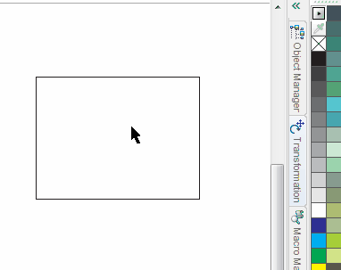

# Интерактивная заливка (Interactive Fill)

_Дата публикации: 06.04.2010_

Как известно, **CorelDRAW** позволяет подойти к решению одинаковых задач с разных сторон. То есть, одни и те же функции могут выполняться разными инструментами, или же, одинаковые команды могут вызываться из разных мест программы. Такой подход предоставляет более гибкие способы решения поставленных задач. Одним из ярких примеров, является инструмент **Interactive Fill**, с помощью которого вы можете создавать и управлять почти всеми типами заливок в CorelDRAW.

Как видно из названия инструмента, одной из его самых значимых сторон является интерактивность. Например, всего в несколько кликов, можно создать сложную градиентную заливку минуя диалоговое окно **Fountain fill**. При этом все манипуляции производятся исключительно в рабочей области документа, и Вы сразу видите результат. На изображении ниже видно, на сколько это быстро и просто. Кстати говоря, инструмент активируется нажатием клавиши **G**.

Все настройки инструмента **Interactive Fill** находятся на панели свойств. В зависимости от выбранного типа заливки, она содержит разные элементы управления. Некоторые из них показаны на изображении ниже.

Особенно хотелось бы отметить удобность ввода значений цвета для **Uniform fill**.

## На заметку

Перетаскивание цвета из палитры на объект с зажатым **Ctrl**, позволяет добавить 10% цвета в заливку. В случае с градиентной заливкой возможно два варианта. Первый – перетаскивание цвета на объект с зажатым **Ctrl**, добавляет 10% цвета во все узлы заливки одновременно. Второй – перетаскивание цвета  только на один узел заливки, соответственно, добавляет 10% цвета только в этот узел. Перетаскивание цвета из палитры на объект с зажатым **Alt**, применяет цвет к контуру.

Способ перетаскивания работает и для градиентной прозрачности. В этом случае используются только оттенки чёрного. 100% black = 100% прозрачности, а белый = 0% прозрачности соответственно.

И ещё немного о перетаскивании. Быстро скопировать заливку с одного на другой объект, можно путём перетаскивания «источника» (то есть объект-пример) удерживая правую кнопку мыши с зажатой клавишей **Shift**, на тот объект, куда нужно скопировать. Если при этом зажать **Alt**, то скопируется контур.
