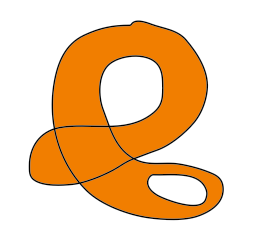

# Режим заливки в CorelDRAW, или почему некоторые кривые имеют заливку в тех областях где должен быть просвет

Наверное каждый пользователь CorelDRAW, хоть раз, но сталкивался с такой проблемой, когда скомбинированные кривые (пути) имеют заливку даже в тех местах где должны быть просветы. И решение то вроде простое — поменять направление одного из путей. Но почему так происходит и что это за баг такой? А может не баг вовсе...

И действительно, это ни какой не баг, а одна из особенностей работы с кривыми. Всё дело в том что CorelDRAW поддерживает два режима заливки: **Alternate** и **Winding**.


По умолчанию в программе используется именно **Alternate** режим, а поменять его на Winding можно только из VBA. Но истинные причины появлений кривых с таким режимом заливки совсем не в VBA, а в импорте файлов ПостСкрипт форматов (_ai, pdf, eps_), где кривые могут иметь заливку с режимом Winding.

Кстати говоря, этот режим имеет одну дополнительную особенность — **реверс направления пути** приводит к появлению просвета, что в свою очередь позволяет использовать залитые участки с просветами в одной кривой.



Т.к. менять режим через пользовательский интерфейс нельзя, я написал макрос, который переключает режим заливки с одного на другой:

```vb
Sub ChangeFillMode()
  If ActiveSelectionRange.Count = 0 Then Exit Sub
  Dim s As Shape
  For Each s In ActiveSelectionRange
    If s.CanHaveFill Then
      If s.Fill.Type <> cdrNoFill Then
        If s.FillMode = cdrFillAlternate Then _
          s.FillMode = cdrFillWinding Else _
          s.FillMode = cdrFillAlternate
      End If
    End If
  Next
End Sub
```

## Для справки

[Nonzero-rule](http://en.wikipedia.org/wiki/Nonzero-rule)
